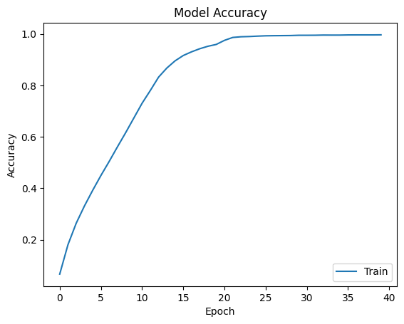

# VGG Paper Reproduction (2015)

## Introduction
This project reproduces the original VGG16 architecture as described in the paper, which will later be used as parameter initilisation for other VGG networks.

## Architecture Summary
| Stage          | Layer   | Type             | Filters / Units | Kernel / Stride | Output Size     |
| -------------- | ------- | ---------------- | --------------- | --------------- | --------------- |
| Input          | Input   | Input            | –               | –               | 224 × 224 × 3   |
| **Block 1**    | Conv1_1 | Conv + BN + ReLU | 64              | 3×3 / 1         | 224 × 224 × 64  |
|                | Conv1_2 | Conv + BN + ReLU | 64              | 3×3 / 1         | 224 × 224 × 64  |
|                | Pool1   | MaxPool          | –               | 2×2 / 2         | 112 × 112 × 64  |
| **Block 2**    | Conv2_1 | Conv + BN + ReLU | 128             | 3×3 / 1         | 112 × 112 × 128 |
|                | Conv2_2 | Conv + BN + ReLU | 128             | 3×3 / 1         | 112 × 112 × 128 |
|                | Pool2   | MaxPool          | –               | 2×2 / 2         | 56 × 56 × 128   |
| **Block 3**    | Conv3_1 | Conv + BN + ReLU | 256             | 3×3 / 1         | 56 × 56 × 256   |
|                | Conv3_2 | Conv + BN + ReLU | 256             | 3×3 / 1         | 56 × 56 × 256   |
|                | Conv3_3 | Conv + BN + ReLU | 256             | 3×3 / 1         | 56 × 56 × 256   |
|                | Pool3   | MaxPool          | –               | 2×2 / 2         | 28 × 28 × 256   |
| **Block 4**    | Conv4_1 | Conv + BN + ReLU | 512             | 3×3 / 1         | 28 × 28 × 512   |
|                | Conv4_2 | Conv + BN + ReLU | 512             | 3×3 / 1         | 28 × 28 × 512   |
|                | Conv4_3 | Conv + BN + ReLU | 512             | 3×3 / 1         | 28 × 28 × 512   |
|                | Pool4   | MaxPool          | –               | 2×2 / 2         | 14 × 14 × 512   |
| **Block 5**    | Conv5_1 | Conv + BN + ReLU | 512             | 3×3 / 1         | 14 × 14 × 512   |
|                | Conv5_2 | Conv + BN + ReLU | 512             | 3×3 / 1         | 14 × 14 × 512   |
|                | Conv5_3 | Conv + BN + ReLU | 512             | 3×3 / 1         | 14 × 14 × 512   |
|                | Pool5   | MaxPool          | –               | 2×2 / 2         | 7 × 7 × 512     |
| **Classifier** | Flatten | Flatten          | –               | –               | 25,088          |
|                | FC6     | Dense + ReLU     | 4096            | –               | 4096            |
|                | Dropout | Dropout          | p = 0.3         | –               | 4096            |
|                | FC7     | Dense + ReLU     | 4096            | –               | 4096            |
|                | Dropout | Dropout          | p = 0.3         | –               | 4096            |
|                | FC8     | Dense            | 200             | –               | 200             |

## Dataset
tiny-imagenet-200 is used as the dataset in this reproduction. Validation set is used as test set, as the actual test set is not labelled. Images are resized from 64×64 to 224×224.

## Reproduced Results
| Metric            | Value |
| ----------------- | ----- |
| Training accuracy | 99.60% |
| Test accuracy     | 49.83% |

The difference between training accuracy and
test accuracy is expected, as the training examples are few compared to the number of parameters in VGG16, which helps CNN memorise the training data set, instead of finding the patterns. For reducing overfitting in the future, some preprocessing techniques like PCA, crop, horizontal flipping and so on should be utilised.

## References
Simonyan, K., & Zisserman, A. (2015). Very deep convolutional networks for large-scale image recognition. International Conference on Learning Representations (ICLR). https://arxiv.org/abs/1409.1556

Tiny ImageNet Dataset
Wu, J., Zhang, J., Xie, Y., & others. (2017).
Tiny ImageNet Visual Recognition Challenge.
Stanford University.
https://tiny-imagenet.herokuapp.com/
